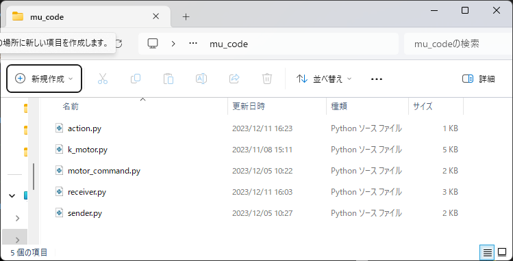
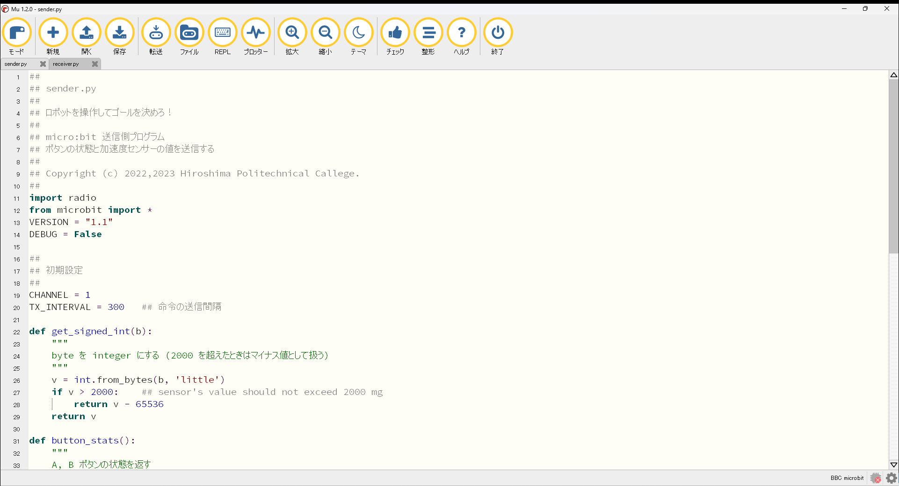
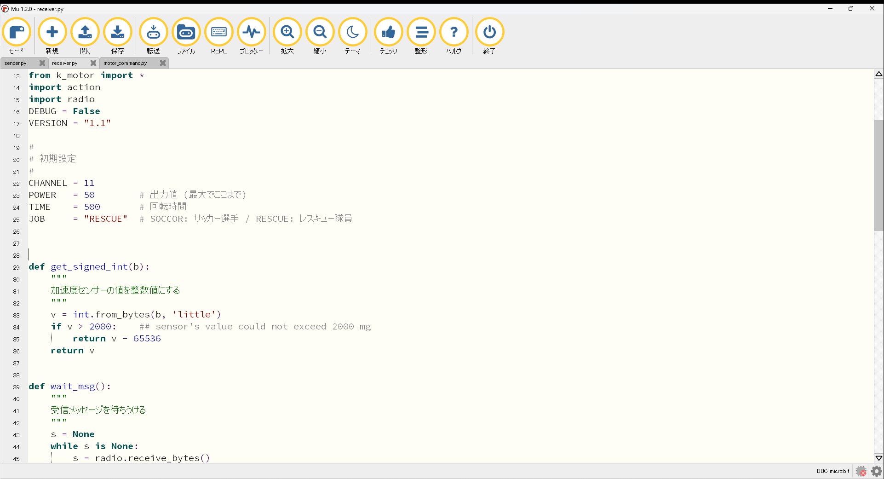
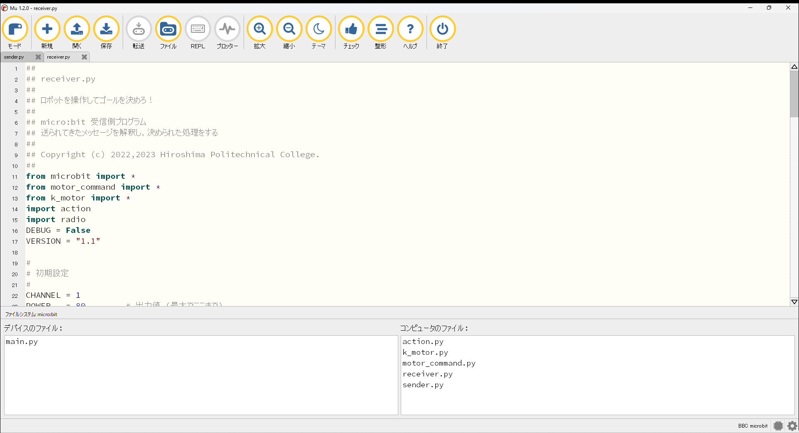

# サッカーロボ / レスキューロボ micro:bit プログラム

送信機能 (sender) と受信機能 (receiver) からなる。

# sender.py

送信機能は sender.py ファイルのみで構成される。

- A,B ボタンの状態 (1byte)
- 加速度センサーの X,Y,Z 値 (2bytes * 3)

の合計 7 バイトを一定周期で受信側に送信する。

# receiver.py

受信機能は receiver.py と motor_command.py, k_motor.py, action.py の 4 ファイルで構成される。

送信機から送られた値によって規定の動作を行う。

# プログラミング準備

## mu エディタ

micro:bit のプログラミングには mu エディタを使う。(Windows のインストーラーでは) mu エディタはユーザーアカウント領域にインストールされるため、各ユーザーごとに行う必要がある。

 - https://codewith.mu/

## ソースコード

github からソースコードを入手する。

```
$ git clone https://github.com/t-kubota72459/microbit-soccer-robo.git
```

入手したら、sender.py, receiver.py, common フォルダの下にある motor_command.py, k_motor.py, action.py の３つのファイルを <ユーザー名>/mu_code フォルダにコピーする。

<center>

</center>

## 送信側セットアップ

mu エディタを起動し、+ アイコンをクリックし、sender.py を開く。  
以下の変数を正しく設定する。

<dl>
<dt>CHANNEL</dt>
<dd>チャンネル変数  
送信機と受信機が使用する通信チャンネル。他の micro:bit とかぶると混信するので注意。
</dd>
<dt>TX_INTERVAL</dt>
<dd>命令の送信間隔  
送信間隔を小さくすれば、命令により素早く反応するが、小さくしすぎると受信側で命令を処理しきれなくなる恐れがある。実際に試して調節する必要がある。
</dd>
</dl>

転送アイコンをクリックし、micro:bit にプログラム (sender.py) を転送する。転送時、micro:bit のデータをクリアするため、少々時間がかかる。
micro:bit の黄色い LED の点滅が終われば転送終了。

<center>

</center>

## 受信機セットアップ

mu エディタを起動し、+ アイコンをクリックし、receiver.py を開く。  

以下の変数を正しく設定する。

<dl>
<dt>CHANNEL</dt>
<dd>チャンネル変数  
送信機と受信機が使用する通信チャンネル。他の micro:bit とかぶると混信するので注意。
</dd>
<dt>POWER</dt>
<dd>モーターへの出力値。単位は %。0~100 の間で設定する。100% にすると現在の電池の状態で可能な最大出力になる。</dd>

<dt>JOB</dt>
<dd> A, B ボタンを同時に押したときのロボの動作を決める。```SOCCOR``` または ```RESCUE``` いずれかを選択する。

<dl>
<dt>- SOCCOR</dt>
<dd>ディスプレイに smile マークが点灯する (ゴール時のパフォーマンス)</dd>
<dt>- RESCUE</dt>
<dd>赤外センサーを駆動するための信号を送信する (生命反応駆動)</dd>
</dl>
</dl>

転送アイコンをクリックし、micro:bit にプログラム (receiver.py) を転送する。転送時、micro:bit のデータをクリアするため、少々時間がかかる。
micro:bit の黄色い LED の点滅が終われば転送終了。

<center>

</center>

### motor_command.py, k_motor.py, action.py ファイルのコピー

次の手順で、receiver.py が使用する motor_command.py, k_motor.py, action.py ファイルを micro:bit にコピーする。
ファイルアイコンをクリックし、画面右下に現れた、motor_command.py, k_motor.py, action.py を左側の micro:bit の領域にドラッグ＆ドロップする。
micro:bit の黄色い LED の点滅が終われば転送終了。

** 注意：再度ファイルアイコンをクリックし、コピー領域を閉じておかないと、micro:bit を取り外した後、再度、PC に取り付けても認識されなくなる。**

<center>

</center>
