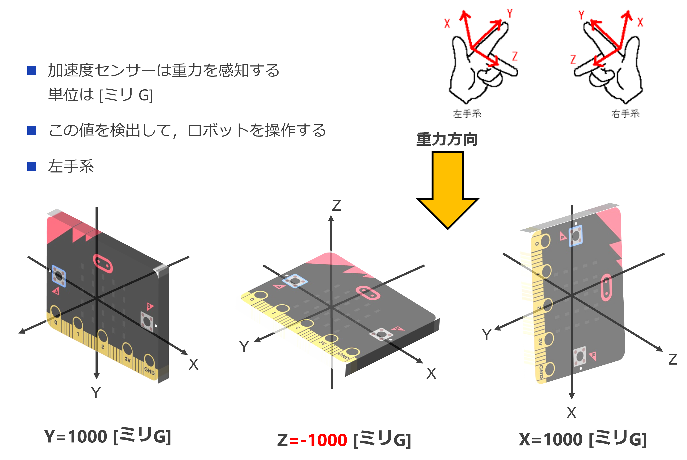

# サッカーロボ / レスキューロボ micro:bit プログラム

送信機能 (sender) と受信機能 (receiver) からなる。

# sender.py

送信機能は sender.py ファイルのみで構成される。

- A,B ボタンの状態 (1byte)
- 加速度センサーの X,Y,Z 値 (2bytes * 3)

の合計 7 バイトを一定周期で受信側に送信する。

加速度センサーについては図を参照：

<center>

</center>

# receiver.py

受信機能は receiver.py と motor_command.py, k_motor.py, action.py の 4 ファイルで構成される。

送信機から送られた値によって規定の動作を行う。

# プログラミング準備

## https://python.microbit.org/v/3

micro:bit のプログラミングにはインターネット上のプログラミング環境 https://python.microbit.org/v/3 を使う。インターネット環境が必要であることに注意する。

## ソースコード

github からソースコードを入手する。

```
$ git clone https://github.com/t-kubota72459/microbit-soccer-robo.git
```

git コマンドがないときには、ウェブブラウザで、

https://github.com/t-kubota72459/microbit-soccer-robo

にアクセスし、Code ⇒ Download ZIP を選択すると、プログラム一式がダウンロードできる。

<center>

</center>

ZIP ファイル形式なので、任意のフォルダに展開しておく。

# sender セットアップ

右下の「開く」を選択し、展開した ZIP ファイルの中にある sender.py を選択する。
「メインコードを sender.py に置き換え」を確認し、実行する。

<center>

</center>

## パラメーターの調整

以下のパラメーターを体験内容などに応じて変更する：

<dl>
<dt>CHANNEL</dt>
<dd>チャンネル変数  
送信機と受信機が使用する通信チャンネル。他の micro:bit とかぶると混信するので注意。
</dd>

<dt>TX_INTERVAL</dt>
<dd>命令の送信間隔  
送信間隔を小さくすれば、命令により素早く反応するが、小さくしすぎると受信側で命令を処理しきれなくなる恐れがある。実際に試して調節する。
</dd>
</dl>

## プログラミング

左下の「micro:bit に送る」を選択し、sender 側 micro:bit をプログラムする。
いくつかウィンドウが開くが、内容に従い選択する。

<center>


</center>

<center>

</center>

# receiver セットアップ

sender とおなじように、https://python.microbit.org/v/3 にアクセスする。

右下の「開く」を選択し、入手したコードの receiver.py を選択する。
「メインコードを receiver.py に置き換え」を確認し、実行する。

以下の変数を正しく設定する。

<dl>
<dt>CHANNEL</dt>
<dd>チャンネル変数  
送信機と受信機が使用する通信チャンネル。他の micro:bit とかぶると混信するので注意。
</dd>

<dt>POWER</dt>
<dd>モーターへの出力値。単位は %。0~100 の間で設定する。100% にすると現在の電池の状態で可能な最大出力になる。</dd>

<dt>TIME</dt>
<dd>A ボタン、B ボタンを押したときのその場での回転時間。単位はミリ秒。250 ミリ秒ぐらいが扱いやすい。</dd>

<dt>JOB</dt>
<dd> A, B ボタンを同時に押したときのロボの動作を決める。```SOCCOR``` または ```RESCUE``` いずれかを選択する。

<dl>
<dt>- SOCCOR</dt>
<dd>ディスプレイに smile マークが点灯する (ゴール時のパフォーマンス)</dd>
<dt>- RESCUE</dt>
<dd>赤外センサーを駆動するための信号を送信する (生命反応駆動)</dd>
</dl>
</dl>

## 重要！モジュールの追加

<strong>receiver 側は複数の Python モジュールで動作するため、以下の作業が必要。</strong>

右下の「開く」を選択し、入手したコードの common フォルダにある action.py, k_motor.py, motor_command.py の３つのファイルをアップロードする。そのとき、「メインコードを action.py に置き換え」の右側のファイルアイコンをクリックし、「action.py ファイルを置き換え」に変更する。
k_motor.py, motor_comannd.py も同じの設定になっていることを確認する。

<center>

</center>

## プログラミング

左下の「micro:bit に送る」を選択し、receiver 側 micro:bit をプログラムする。

# 状態 (プロジェクト) の保存

右下の「保存」を選択すると、プロジェクト単位（送信側なら sender.py のみ、受信側なら receiver.py, action.py, k_motor.py, motor_command.py の 4 ファイル）でローカルの PC 上にダウンロードして保存できる。(拡張子は .hex)

保存したファイルは、「開く」を使って再利用可能。
